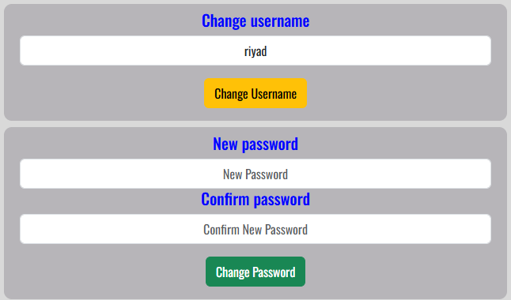
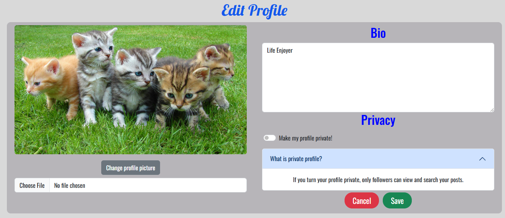

# Socialize

**Developer: Oğuzhan Akça**

[View live website](https://socialize-frontend-app-cfe4edcc8238.herokuapp.com/)

## Table of Contents

1. [About](#about)
2. [User Experience](#user-experience)
   1. [Target Audience](#target-audience)
   2. [User Requirements and Expectations](#user-requirements-and-expectations)
   3. [User Stories](#user-stories)
3. [Technical Design](#technical-design)
   1. [Agile Design](#agile-design)
   2. [CRUD Functionality](#crud-functionality)
   3. [Colours](#colours)
   4. [Fonts](#fonts)
   5. [Wireframes](#wireframes)
4. [Technologies Used](#technologies-used)
   1. [Coding Languages](#coding-languages)
   2. [Frameworks and Tools](#frameworks-and-tools)
   3. [Libraries](#libraries)
5. [Features](#features)
6. [Future features / improvements](#future-features--improvements)
7. [Validation](#validation)
   1. [HTML](#html-validation)
   2. [CSS](#css-validation)
   3. [ESLint JavaScript JSX Validation](#eslint-javascript-jsx-validation)
   4. [Chrome Dev Tools Lighthouse](#chrome-dev-tools-lighthouse-validation)
   5. [WAVE Validation](#wave-validation)
8. [Testing](#testing)
   1. [Browser Compatibility](#browser-compatibility)
   2. [Manual Testing](#manual-testing)
9. [Bugs](#bugs)
10. [Deployment](#deployment)
11. [Credits](#credits)

## About

Socialize is a social media app that allows users to share images and chat with each other.

## User Experience

### Target Audience

- People who would like share their experiences with images
- People who would like have contact with people
- People who would like to watch others

### User Requirements and Expectations

- Fully responsive
- Accessible
- A welcoming design
- Accessibility
- Design and content that will not tire the reader's eyes
- Links that work as they should

### User Stories

1. As a user, I can create a new account so that I can access all the features for signed up users.
2. As a user, I can sign in to the app so that I can access functionality for logged in users.
3. As a user, I can tell if I am logged in or not so that I can log in if I need to.
4. As a user, I can view user's avatars so that I can easily identify users of the application.
5. As a user I, can view other users profiles so that I can see their posts and learn more about them.
6. As a user I can see a list of the most followed profiles so that I can see which profiles are popular.
7. As a user, I can view statistics about a specific profile: bio, number of posts, follows and users followed so that I can learn more about them.
8. As a logged in user, I can edit my profile so that I can change my profile picture and bio.
9. As a logged in user, I can change my username and password so that I can change my name and keep my profile secure.
10. As a logged in user, I can create posts so that I can share my experiences and images with others.
11. As a user, I can view the details of a single post so that I can learn more about it.
12. As a user, I can view all the most recent posts so that I am up to date with the newest content.
13. As a logged in user, I can view the posts I liked so that I can review them.
14. As a user, I can search for posts with keywords, so that I can find the posts and user profiles I am most interested in.
15. As a post owner, I can edit my post title and description so that I can make corrections or update my post after it was created.
16. As a user, I can view the specific post so that I can read the comments about the post.
17. As a user, I want to have a navigation bar that provides easy access to different sections of the app so that I can quickly navigate.
18. As a user, I can navigate through pages quickly so that I can view content without requiring page refresh.
19. As a not logged in user, I can see sign in and sign up options so that I can sign in/sign up.
20. As a user, I can keep scrolling through the pages on the site, that are loaded for me automatically so that I have better user experience.
21. As a logged in user, I can comment on posts so that I can share my opinion about post with others.
22. As a user, I can see when a comment was made so that I know how old a comment is.
23. As an owner of a comment, I can delete my comment so that I can control removal of my comment from the application.
24. As an owner of a comment, I can edit my comment so that I can fix or update my existing comment.
25. As a logged in user, I can follow and unfollow other users so that I can see and remove posts by specific users in my posts feed.
26. As a user, I want to start a chat with another user so that I can communicate with them through private messages.
27. As a user, I want to see a list of all my previous chats so that I can easily access my past conversations.
28. As a user, I want to send a message in a selected chat so that I can share my thoughts and information within the conversation.
29. As a user, I want to delete my own messages so that I can remove any messages sent by mistake or those that are no longer needed.
30. As a logged in user, I can like a post so that I can show my support for the posts that interest me.
31. As a logged in user, I can like a comment so that I can show my support for the comments that interest me.
32. As a user, I want to be informed when I navigate a page that does not exist.

## Technical Design

### Agile Design

An Agile approach to creating this app has been applied. GitHub's projects was used to track user stories and implement ideas based on their level of importance for allowing use of the app with no loss of functionality or user experience. Three categories were created indicating their level of importance, those were:

- MUST HAVE
- SHOULD HAVE
- COULD HAVE

By using AGILE methodology in this project I was able to deliver a site which had all required functionality and some more. Due to the time limit on this project I was not able to incorporate all initial listed features, but this is where an AGILE approach is great for app design. The project displays this by having User stories in the Done section and the ones which were decided to be left for future, put in the future implementations section of the readme.

The GitHub project can be found [here](https://github.com/users/oguzhanakca/projects/2)

### CRUD Functionality

Socialize handles data with full CRUD Functionality:
 

- Create - Users can create an account, profile, post, comment, like, follow, chat and message objects.
- Read - Users can read the profile, posts, comments, messages.
- Update - Users can update their profile, username, password, posts, comments, likes, follows via the interactive forms and buttons on the site.
- Delete - Users can delete posts, comments, likes, follows and messages via the interactive buttons on the site.

### Colours

Custom colour palette used. The colours used in the project listed below:

### Fonts

From Google Fonts:

- PT Sans
- Oswald
- Lobster
  fonts are used.

### Wireframes

Balsamiq was used to create wireframes of the sites pages

Wireframes

## Technologies Used

### Coding Languages

- HTML
- CSS
- Javascript

### Frameworks and Tools

- [Axios](https://axios-http.com/docs/intro)
- [React](https://create-react-app.dev/docs/getting-started)
- [React-Bootstrap 1.6.3](https://react-bootstrap.netlify.app/docs/components/accordion/)
- [React Infinite Scroll](https://www.npmjs.com/package/react-infinite-scroll-component)
- [React Router](https://reactrouter.com/en/main)
- [Am I Responsive](http://ami.responsivedesign.is/)
- [Balsamiq](https://balsamiq.com/)
- [Chrome dev tools](https://developers.google.com/web/tools/chrome-devtools/)
- [Cloudinary](https://cloudinary.com/)
- [Font Awesome](https://fontawesome.com/)
- [Google Fonts](https://fonts.google.com/)
- [Git](https://git-scm.com/)
- [GitHub](https://github.com/)
- [WC3 Validator](https://validator.w3.org/)
- [Jigsaw W3 Validator](https://jigsaw.w3.org/css-validator/)
- [ESLint](https://eslint.org/)
- [Lighthouse](https://developers.google.com/web/tools/lighthouse/)
- [Wave](https://wave.webaim.org/)

### React

The React.js framework is an open-source JavaScript framework and library developed by Jordan Walke, a software engineer at Meta. It's used for building interactive user interfaces and web applications quickly and efficiently with significantly less code than you would with vanilla JavaScript

I used React for this application for several reasons:

- Flexibility – Due to having a modular structure React code is easier to maintain compared to other front-end frameworks.

- Speed – Creating sites/apps with React significantly increases the page loading speed as the entire page does not require to refresh and reload all components. Components are updated dynamically thus reducing the wait and load times, which affects user experience.

- React Bootstrap - When used for styling and responsiveness React Bootstrap is a great choice as it comes with ready-to-use React built components thus taking away alot of need to create commonly used code from scratch.

- Reusability of components – Components can be created and re used throughout the app with no need to re write code for the same features.

There were various components created and reused across this application.

- Asset - Reusable component. Used to show a spinner until the request is completed. Also used for the information messages.
- Avatar - Reusable component. Used to show profile image of the requested user.
- MoreDropdown - Reusable component. Used to show dropdown menu for comments and posts.
- NavBar - Reusable component. Used for easy navigation of the site. Shows in every page.
- ResponsiveImage - Reusable component. Used to convert image type for the images requested from cloudinary.
- CurrentUserContext - Reusable context. Used to manage current user's authentication state.
- ProfileDataContext - Reusable context. Used to manage user profile data and stores popular profiles and follow actions.
- useClickOutsideToggle - Used to close dropdown of NavBar.
- useRedirect - Used to redirect users when they logged in or logged out.

There are various pages created in this application.

- auth
  - SignInForm - Handles sign in form.
  - SignUpForm - Handles sign up form.
- chats
  - ChatDetail - Shows the desired chat page between users.
  - ChatItem - Returns the avatars of the users who has chat history.
  - ChatList - Lists all the chat current user have.
  - Message - Shows avatar and message of the owner.
- comments
  - Comment - Returns the comments.
  - CommentCreateForm - Handles the create comment form.
  - CommentEditForm - Handles the edit comment form.
- error
  - NotFound - Shows when users try to navigate a page that does not exist.
- followers
  FollowersPage - Displays the followers and followings of the profile.
- posts
  - Post - Returns the information of post.
  - PostCreateForm - Handles the post create form.
  - PostEditForm - Handles the post edit form.
  - PostPage - Displays information of one selected post and its comments.
  - PostsPage - Homepage. Displays the posts of the users.
- profiles
  - PopularProfiles - Returns most followed profiles.
  - Profile - Returns the profile of user.
  - ProfileEditForm - Handles the profile edit form.
  - ProfilePage - Displays the profile of users with their posts.
  - ProfileSettings - Handles username and password forms for the profile owners.

## Features

In its entirety the website consists of a variety of features across the many site pages as listed below.

### Homepage

- Welcomes the users when they first visit the website.
- Contains Search bar, Posts, Most Followed Users.

Homepage

- Covered in user stories: 4, 6, 12, 14, 20, 25

### Navigation Bar

- Users can navigate through the website with it.
- Display different views based on whether the user is logged in or not.
- User's can sign out here.
- Current page shows in different color.

Navigation Bar

- Covered in user stories: 3, 17, 18, 19

### Sign In

- Displays when user navigates to "Sign In" from Navigation Bar.
- Contains Sign In Form.
- Validates if username and password are correct.

Sign In

- Covered in user stories: 2, 3, 19

### Sign Up

- Displays when user navigates to "Sign In" from Navigation Bar.
- Contains Sign Up Form.
- Validates the username if it exists.
- Validates the password for better security.

Sign Up

- Covered in user stories: 1, 19

### Profile

- Automatically created when users sign up.
- Required to use website features.
- Displays the information of user such as username, bio, posts, followers, followings.
- Profile owner can change the image.
- Profile owner can change the profile public or private.
- Profile owner can change username and password.

Profile

- Covered in user stories: 4, 5, 6, 7, 8, 9

### Most Followed Profiles

- Displays the profiles that has most followers on website.
- The amount of profiles that are shown are changes with the viewport.

Most Followed Profiles

- Covered in user stories: 6

### Follow

- Creates a connection between current user and the desired user.
- Private profile's posts can be viewed by following them.
- Users can view their followers and followings by navigating through Navigation Bar.

Follow

- Covered in user stories: 25

### Post

- Users can share and view their images and opinions.
- Every post has image, title and their content.
- Users can like and comment on posts.
- Users can view the posts they like from the navigation bar.
- Posts can be created by navigation bar.
- Post owners can edit and delete their posts in post page.
- Users can search posts by their owner and title.

Post

- Covered in user stories: 10, 11, 12, 13, 14, 15, 16, 20

### Comment

- Logged in users can comment on the post they want in the post page.
- Comment owner can edit or delete their comment.
- Users can like others comment.

Comment

- Covered in user stories: 16, 20, 21, 22, 23, 24

### Like

- Logged in users can like the posts and the comments they want.
- Like owners can delete their like with the same button.
- Like button shows Red if the user already liked.
- Users can not like their own post and comment.
- Users can view the posts they liked through the navigation bar.

Like

- Covered in user stories: 30, 31

### Chat

- Logged in users can create a chat room with the user they want.
- If the chat room already exist, new one will not be created.
- Users can't create a chat room with themselves.
- Logged in users can view their chat list through the navigation bar.

Chat

- Covered in user stories: 26, 27

### Message

- Users can send message to other users in the chat page.
- Users can't send message to themselves.
- Message owners can delete their message.
- Users can view their own message in different color.

Message

- Covered in user stories: 28, 29

### Not Found

- Displays when the adress is wrong.
- Inform users that the page does not exist.

Not Found

- Covered in user stories: 32

## Future features / improvements

Although alot of effort was put into this project, due to time constraints there is still room for finer refactoring of code and additional functionality / features to implement to the site.

- Adding e-mail to profiles and using it as a security factor.
- Adding notifications system for like, comment and messages.
- Adding a search specific page with a filter-sort option.
- Viewing the profiles that liked a post or comment.
- Adjusting code for better performance.

## Validation

### HTML Validation

The W3C Markup Validation Service was used to validate the HTML of the website. No errors were identified.

Chat Detail
 
 

Chat List
 
 

Add Post
 
 

Edit Profile
 
 

Followers
 
 

Homepage
 
 

Liked
 
 

Post Page
 
 

Profile Page
 
 

Profile Settings
 
 

Sign In
 
 

Add Post
 
 

### CSS Validation

The W3C Jigsaw CSS Validation Service was used to validate the CSS of the website. All CSS modules pass the validation with no errors.

Result
 
 

### ESLint JavaScript JSX Validation

All JavaScript files were validated using ESLint JavaScript validator. All files passed.

### Chrome Dev Tools Lighthouse Validation

Lighthouse was used to test the performance, accessibility, best practice and SEO of the site. The validation was done for both desktop & mobile.

#### Desktop

Followers
 
 

Not Logged In Homepage
 
 

Liked
 
 

Logged In Homepage
 
 

Add Post
 
 

Post Page
 
 

Edit Post
 
 

Profile Page
 
 

Sign In
 
 

Sign Up
 
 

#### Mobile

Followers
 
 

Not Logged In Homepage
 
 

Liked
 
 

Logged In Homepage
 
 

Add Post
 
 

Post Page
 
 

Edit Post
 
 

Profile Page
 
 

Sign In
 
 

Sign Up
 
 

### Wave Validation

The WAVE WebAIM web accessibility evaluation tool was used to test the websites accessibility.

Add Post
 
 

Chat Detail
 
 

Chat List
 
 

Edit Profile
 
 

Followers
 
 

Homepage
 
 

Liked
 
 

Not Found
 
 

Edit Post
 
 

Post Detail
 
 

Profile Page
 
 

Profile Settings
 
 

Sign In
 
 

Sign Up
 
 

## Testing

### Browser compatibility

The website was tested on the following web browsers:

- Google Chrome
- Opera
- Microsoft Edge

### Manual testing

#### Testing User Stories - Users

1. As a user, I can create a new account so that I can access all the features for signed up users.

| Feature | Action                                                                                | Expected Result         | Actual Result     |
| ------- | ------------------------------------------------------------------------------------- | ----------------------- | ----------------- |
| Sign Up | Navigate to the sign up page, fill in the required fields and submit the sign up form | Account will be created | Works as expected |

Screenshots

2. As a user, I can sign in to the app so that I can access functionality for logged in users.

| Feature | Action                                                   | Expected Result             | Actual Result     |
| ------- | -------------------------------------------------------- | --------------------------- | ----------------- |
| Sign In | Click the "Sign In" through the navbar and fill the form | User will log in to the app | Works as expected |

Screenshots

3. As a user, I can tell if I am logged in or not so that I can log in if I need to.

| Feature          | Action                                                                                   | Expected Result                                          | Actual Result     |
| ---------------- | ---------------------------------------------------------------------------------------- | -------------------------------------------------------- | ----------------- |
| Logged in Status | Check the right top corner, if "Sign In" and "Sign Up" are there, user is not logged in. | Navigation bar will render different for logged in users | Works as expected |

Screenshots

4. As a user, I can view user's avatars so that I can easily identify users of the application.

| Feature | Action                                | Expected Result                                     | Actual Result     |
| ------- | ------------------------------------- | --------------------------------------------------- | ----------------- |
| Profile | View the circle image near users name | Users will have their profile image near their name | Works as expected |

Screenshots

5. As a user I, can view other users profiles so that I can see their posts and learn more about them.

| Feature      | Action                                    | Expected Result                       | Actual Result     |
| ------------ | ----------------------------------------- | ------------------------------------- | ----------------- |
| Profile Page | Click the profile image near the username | User will be directed to profile page | Works as expected |

Screenshots

6. As a user I can see a list of the most followed profiles so that I can see which profiles are popular.

| Feature             | Action                                                                            | Expected Result                       | Actual Result     |
| ------------------- | --------------------------------------------------------------------------------- | ------------------------------------- | ----------------- |
| Most Followed Users | Check the top of homepagefor mobile, for desktop check the right side of the page | Most followed users will be displayed | Works as expected |

Screenshots

7. As a user, I can view statistics about a specific profile: bio, number of posts, follows and users followed so that I can learn more about them.

| Feature      | Action                                                                           | Expected Result                    | Actual Result     |
| ------------ | -------------------------------------------------------------------------------- | ---------------------------------- | ----------------- |
| Profile Page | Navigate to the profile page of the desired user by clicking their profile image | Profile information will be showed | Works as expected |

Screenshots

8. As a logged in user, I can edit my profile so that I can change my profile picture and bio.

| Feature      | Action                                                                                    | Expected Result             | Actual Result     |
| ------------ | ----------------------------------------------------------------------------------------- | --------------------------- | ----------------- |
| Edit Profile | Click the profile image in Navigation Bar, then click the "Edit Profile" in dropdown menu | User can edit their profile | Works as expected |

Screenshots

9. As a logged in user, I can change my username and password so that I can change my name and keep my profile secure.

| Feature          | Action                                                                                | Expected Result                       | Actual Result     |
| ---------------- | ------------------------------------------------------------------------------------- | ------------------------------------- | ----------------- |
| Profile Settings | Click the profile image in Navigation Bar, then click the "Settings" in dropdown menu | User can change username and password | Works as expected |

Screenshots

10. As a logged in user, I can create posts so that I can share my experiences and images with others.

| Feature     | Action                                                                      | Expected Result                                              | Actual Result     |
| ----------- | --------------------------------------------------------------------------- | ------------------------------------------------------------ | ----------------- |
| Create Post | Click the "Add Post" button in Navigation bar and navigate to Add Post page | User can create post by adding image, title name and content | Works as expected |

Screenshots

11. As a user, I can view the details of a single post so that I can learn more about it.

| Feature   | Action                              | Expected Result                          | Actual Result     |
| --------- | ----------------------------------- | ---------------------------------------- | ----------------- |
| Post Page | Click the image of the desired post | User will be directed to the post's page | Works as expected |

Screenshots

12. As a user, I can view all the most recent posts so that I am up to date with the newest content.

| Feature  | Action                                     | Expected Result                      | Actual Result     |
| -------- | ------------------------------------------ | ------------------------------------ | ----------------- |
| Homepage | Click the "Home" button in Navigation bar. | User will view the most recent posts | Works as expected |

Screenshots

13. As a logged in user, I can view the posts I liked so that I can review them.

| Feature     | Action                                      | Expected Result                      | Actual Result     |
| ----------- | ------------------------------------------- | ------------------------------------ | ----------------- |
| Liked Posts | Click the "Liked" button in Navigation bar. | Users will view the posts they liked | Works as expected |

Screenshots

14. As a user, I can search for posts with keywords, so that I can find the posts and user profiles I am most interested in.

| Feature | Action                                                 | Expected Result                            | Actual Result     |
| ------- | ------------------------------------------------------ | ------------------------------------------ | ----------------- |
| Search  | In homepage, use the search bar on the top of the page | Posts will be filtered by the word entered | Works as expected |

Screenshots

15. As a post owner, I can edit my post title and description so that I can make corrections or update my post after it was created.

| Feature   | Action                                                                                | Expected Result                                               | Actual Result     |
| --------- | ------------------------------------------------------------------------------------- | ------------------------------------------------------------- | ----------------- |
| Edit Post | In the Post Page, click the cog on the top right of the post, click the "Edit" button | User will be directed to edit post page and can edit the post | Works as expected |

Screenshots

16. As a user, I can view the specific post so that I can read the comments about the post.

| Feature | Action                                                     | Expected Result                                                        | Actual Result     |
| ------- | ---------------------------------------------------------- | ---------------------------------------------------------------------- | ----------------- |
| Comment | Click the post image and scroll down in the navigated page | Comments will be shown, if there is no comments, user will be informed | Works as expected |

Screenshots

17. As a user, I want to have a navigation bar that provides easy access to different sections of the app so that I can quickly navigate.

| Feature        | Action                      | Expected Result                             | Actual Result     |
| -------------- | --------------------------- | ------------------------------------------- | ----------------- |
| Navigation Bar | Check the top of every page | Navigation bar will be showed in every page | Works as expected |

Screenshots

18. As a user, I can navigate through pages quickly so that I can view content without requiring page refresh.

| Feature        | Action                                           | Expected Result        | Actual Result     |
| -------------- | ------------------------------------------------ | ---------------------- | ----------------- |
| Navigation Bar | Click the desired adress to go in navigation bar | User will be navigated | Works as expected |

Screenshots

19. As a not logged in user, I can see sign in and sign up options so that I can sign in/sign up.

| Feature        | Action                                          | Expected Result                          | Actual Result     |
| -------------- | ----------------------------------------------- | ---------------------------------------- | ----------------- |
| Navigation Bar | Check the navigation bar to sign in and sign up | Not logged in users will see the options | Works as expected |

Screenshots

20. As a user, I can keep scrolling through the pages on the site, that are loaded for me automatically so that I have better user experience.

| Feature         | Action                                      | Expected Result                                                                | Actual Result     |
| --------------- | ------------------------------------------- | ------------------------------------------------------------------------------ | ----------------- |
| Infinity Scroll | Scroll down through the homepage, post page | If there is more to load, pages will keep loading once the user keep scrolling | Works as expected |

21. As a logged in user, I can comment on posts so that I can share my opinion about post with others.

| Feature    | Action                                            | Expected Result                                          | Actual Result     |
| ---------- | ------------------------------------------------- | -------------------------------------------------------- | ----------------- |
| Commenting | In the post page, scroll down to see Comment form | User can write and send their comment with "Post" button | Works as expected |

Screenshots

22. As a user, I can see when a comment was made so that I know how old a comment is.

| Feature | Action                                   | Expected Result                          | Actual Result     |
| ------- | ---------------------------------------- | ---------------------------------------- | ----------------- |
| Comment | Check the date near comment owner's name | User will see when the comment is posted | Works as expected |

Screenshots

23. As an owner of a comment, I can delete my comment so that I can control removal of my comment from the application.

| Feature      | Action                                             | Expected Result                 | Actual Result     |
| ------------ | -------------------------------------------------- | ------------------------------- | ----------------- |
| Edit Comment | Click the cog near the comment then click "Delete" | Desired comment will be deleted | Works as expected |

Screenshots

24. As an owner of a comment, I can edit my comment so that I can fix or update my existing comment.

| Feature      | Action                                           | Expected Result                                               | Actual Result     |
| ------------ | ------------------------------------------------ | ------------------------------------------------------------- | ----------------- |
| Edit Comment | Click the cog near the comment then click "Edit" | Desired comment will change with form, click "Save" to change | Works as expected |

Screenshots

25. As a logged in user, I can follow and unfollow other users so that I can see and remove posts by specific users in my posts feed.

| Feature | Action                                           | Expected Result                    | Actual Result     |
| ------- | ------------------------------------------------ | ---------------------------------- | ----------------- |
| Follow  | In profile page, click follow / unfollow buttons | User will be followed / unfollowed | Works as expected |

Screenshots

26. As a user, I want to start a chat with another user so that I can communicate with them through private messages.

| Feature | Action                                          | Expected Result                                            | Actual Result     |
| ------- | ----------------------------------------------- | ---------------------------------------------------------- | ----------------- |
| Chat    | In the user's profile page, click the "Message" | User will be redirected to chat room with the desired user | Works as expected |

Screenshots

27. As a user, I want to see a list of all my previous chats so that I can easily access my past conversations.

| Feature   | Action                             | Expected Result               | Actual Result     |
| --------- | ---------------------------------- | ----------------------------- | ----------------- |
| Chat List | Click "Chat" in the navigation bar | Previous chats will be loaded | Works as expected |

Screenshots

28. As a user, I want to send a message in a selected chat so that I can share my thoughts and information within the conversation.

| Feature      | Action                                                                                                  | Expected Result        | Actual Result     |
| ------------ | ------------------------------------------------------------------------------------------------------- | ---------------------- | ----------------- |
| Send Message | Click the desired chat in chat list, in navigated chat, write the message and press "Send" button below | A message will be sent | Works as expected |

Screenshots

29. As a user, I want to delete my own messages so that I can remove any messages sent by mistake or those that are no longer needed.

| Feature        | Action                                                                    | Expected Result         | Actual Result     |
| -------------- | ------------------------------------------------------------------------- | ----------------------- | ----------------- |
| Delete Message | In the chat, click the Trash Bin icon near message to delete that message | Message will be deleted | Works as expected |

Screenshots

29. As a logged in user, I can like a post so that I can show my support for the posts that interest me.

| Feature   | Action                                                             | Expected Result    | Actual Result     |
| --------- | ------------------------------------------------------------------ | ------------------ | ----------------- |
| Like post | Under the post image, click the Heart button to like / unlike post | Like / Unlike post | Works as expected |

Screenshots

29. As a logged in, user I can like a comment so that I can show my support for the comments that interest me.

| Feature   | Action                                                 | Expected Result       | Actual Result     |
| --------- | ------------------------------------------------------ | --------------------- | ----------------- |
| Like post | Click the Heart icon under to comment to like / unlike | Like / Unlike comment | Works as expected |

Screenshots

## Bugs

| **Bug**                                                                                                              | **Fix**                                                 |
| -------------------------------------------------------------------------------------------------------------------- | ------------------------------------------------------- |
| An error occurs when deleting chat                                                                                   | Not fixed yet, delete message is temporary disabled     |
| Infinite Scroll is getting bugged and keep refreshing when a user try to follow/unfollow someone in "Followers" page | Not fixed, Follow / Unfollow disabled in Followers page |
| Creating chat takes too long                                                                                         | Still investigating what causes it                      |
| API responses are too slow                                                                                           | Still investigating how to make it faster               |
| When post images are too big, they squish. But if i let them keep their size, lighthouse test fails too hard         | Still investigating                                     |
| If a private profile is followed, page must be refresh to see their posts                                            | Still investigating                                     |
| Error occured when deleting and posting comments                                                                     | Fixed                                                   |

## Deployment

The application was deployed to [Heroku](https://heroku.com). A live version of the application can be found at [Socialize](https://socialize-frontend-app-cfe4edcc8238.herokuapp.com/).

Please follow these steps to deploy the application:

1. Deploy your own version of the [Socialize Backend](https://github.com/oguzhanakca/socialize-backend) by following the [deployment instructions for the Socialize Backend](https://github.com/oguzhanakca/socialize-backend?tab=readme-ov-file#deployment).

2. Clone or fork this repository. For forking it, go to https://github.com/oguzhanakca/socialize-frontend, click on `Fork` and follow the instructions. For cloning the repository, run `git clone https://github.com/oguzhanakca/socialize-frontend.git` in your terminal.

   

   
Show image

   

   

3. Go to the repository folder and edit the file `src/api/axiosDefaults.js`. In the file, change the value of `axios.defaults.baseURL` to the URL of your deployed API. You can find the URL by clicking on your API app from the Heroku dashboard and then copying the URL from the `Open app` button.

4. If you haven't done so yet, login to your Heroku account at https://heroku.com. Now start a new app from the [Heroku dashboard](https://dashboard.heroku.com) by clicking on `New` and then on `Create new app`.

   

   
Show image

   

   

5. Give your app an available name and choose your region (US or Europe).

6. Click on the _Deploy_ tab and connect the Heroku app to your GitHub repository.

   

   
Show image

   

   

7. Scroll down and select the branch you want to deploy in the _Manual deploy_ section. Now click on `Deploy Branch` for the first deployment of the application.

   

   
Show image

   

   

8. After successful deployment, click on `View` to open your deployed app.

   

   
Show image

   

   

## Credits

This project was created based on the Code Institute's walkthrough project [Moments](https://github.com/mr-fibonacci/moments/tree/master/src).

- By occuring errors, i dig through [Stack Overflow](https://stackoverflow.com/). Although i couldn't really find an exact answers for my problems, it helped me to understand what may be wrong.

- Official documentation of the written libraries are used.

- Every image in the app is found in [Pexels](https://www.pexels.com/)
