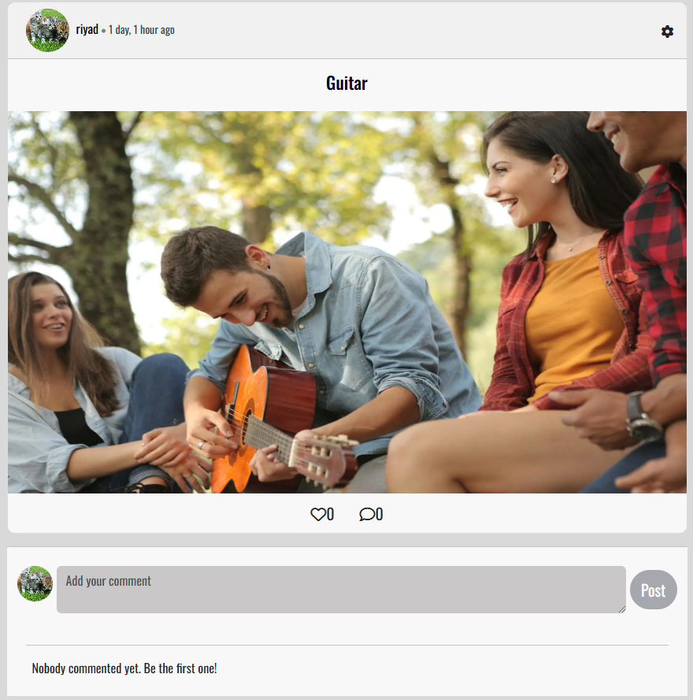

# Socialize
**Developer: Jamie King**

[View live website](https://socialize-frontend-app-cfe4edcc8238.herokuapp.com/)

## Table of Contents
  1. [About](#about)
  3. [User Experience](#user-experience)
      1. [Target Audience](#target-audience)
      2. [User Requirements and Expectations](#user-requirements-and-expectations)
      3. [User Stories](#user-stories)
  4. [Technical Design](#technical-design)
      1. [Agile Design](#agile-design)
      2. [CRUD Functionality](#crud-functionality)
      4. [Fonts](#fonts)
      5. [Wireframes](#wireframes)
  5. [Technologies Used](#technologies-used)
      1. [Coding Languages](#coding-languages)
      2. [Frameworks and Tools](#frameworks-and-tools)
      3. [Libraries](#libraries)
  6. [Front-End](#front-end)
      1. [React](#react)
  7. [Back-End API](#back-end-api)
      1. [Django REST Framework](#django-rest-framework)
  8. [Features](#features)
  9. [Future features / improvements](#future-features--improvements)
  10. [Validation](#validation)
      1. [HTML](#html-validation)
      2. [CSS](#css-validation)
      3. [ESLint JavaScript JSX Validation](#eslint-javascript-jsx-validation)
      4. [Chrome Dev Tools Lighthouse](#chrome-dev-tools-lighthouse-validation)
      5. [WAVE Validation](#wave-validation)
  11. [Testing](#testing)
      1. [Device Testing](#device-testing)
      2. [Browser Compatibility](#browser-compatibility)
      3. [Manual Testing](#manual-testing)
  12. [Bugs](#bugs)
  13. [Deployment](#deployment)
      1. [Heroku](#heroku)
      2. [Forking GitHub Repo](#forking-the-github-repository)
      3. [Clone a GitHub Repo](#clone-a-github-repository)
  14. [Credits](#credits)
      1. [Tutorial](#tutorials)
      2. [Code](#code)
      3. [Literature](#literature)
      4. [Misc](#misc)
  15. [Acknowledgements](#acknowledgements)

## About

Socialize is a social media app that allows users to share images and chat with each other.

## User Experience

### Target Audience

- People who would like share their experiences with images
- People who would like have contact with people
- People who would like to watch others

### User Requirements and Expectations

- Fully responsive
- Accessible
- A welcoming design
- Accessibility
- Design and content that will not tire the reader's eyes
- Links that work as they should

### User Stories

1. As a user, I can create a new account so that I can access all the features for signed up users.
2. As a user, I can sign in to the app so that I can access functionality for logged in users.
3. As a user, I can tell if I am logged in or not so that I can log in if I need to.
5. As a user, I can view user's avatars so that I can easily identify users of the application.
6. As a user I, can view other users profiles so that I can see their posts and learn more about them.
7. As a user I can see a list of the most followed profiles so that I can see which profiles are popular.
8. As a user, I can view statistics about a specific profile: bio, number of posts, follows and users followed so that I can learn more about them.
9. As a logged in user, I can edit my profile so that I can change my profile picture and bio.
10. As a logged in user, I can change my username and password so that I can change my name and keep my profile secure.
11. As a logged in user, I can create posts so that I can share my experiences and images with others.
12. As a user, I can view the details of a single post so that I can learn more about it.
13. As a user, I can view all the most recent posts so that I am up to date with the newest content.
14. As a logged in user, I can view the posts I liked so that I can review them.
15. As a user, I can search for posts with keywords, so that I can find the posts and user profiles I am most interested in.
17. As a post owner, I can edit my post title and description so that I can make corrections or update my post after it was created.
18. As a user, I can view the specific post so that I can read the comments about the post.
19. As a user, I want to have a navigation bar that provides easy access to different sections of the app so that I can quickly navigate.
20. As a user, I can navigate through pages quickly so that I can view content without requiring page refresh.
21. As a not logged in user, I can see sign in and sign up options so that I can sign in/sign up.
22. As a user, I can keep scrolling through the pages on the site, that are loaded for me automatically so that I have better user experience.
23. As a logged in user, I can comment on posts so that I can share my opinion about post with others.
24. As a user, I can see when a comment was made so that I know how old a comment is.
25. As an owner of a comment, I can delete my comment so that I can control removal of my comment from the application.
26. As an owner of a comment, I can edit my comment so that I can fix or update my existing comment.
27. As a logged in user, I can follow and unfollow other users so that I can see and remove posts by specific users in my posts feed.
28. As a user, I want to start a chat with another user so that I can communicate with them through private messages.
29. As a user, I want to see a list of all my previous chats so that I can easily access my past conversations.
30. As a user, I want to send a message in a selected chat so that I can share my thoughts and information within the conversation.
31. As a user, I want to edit my own messages so that I can correct any mistakes I made in the message.
32. As a user, I want to delete my own messages so that I can remove any messages sent by mistake or those that are no longer needed.
33. As a logged in user, I can like a post so that I can show my support for the posts that interest me.
34. As a logged in user, I can like a comment so that I can show my support for the comments that interest me.
35. As a user, I want to be informed when I navigate a page that does not exist.

## Technical Design

### Agile Design

An Agile approach to creating this app has been applied. GitHub's projects was used to track user stories and implement ideas based on their level of importance for allowing use of the app with no loss of functionality or user experience. Three categories were created indicating their level of importance, those were:
- MUST HAVE
- SHOULD HAVE
- COULD HAVE

By using AGILE methodology in this project I was able to deliver a site which had all required functionality and some more. Due to the time limit on this project I was not able to incorporate all initial listed features, but this is where an AGILE approach is great for app design. The project displays this by having User stories in the Done section and the ones which were decided to be left for future, put in the future implementations section of the readme.

The GitHub project can be found [here](https://github.com/users/oguzhanakca/projects/2)

### CRUD Functionality

Socialize handles data with full CRUD Functionality:
 
- Create -  Users can create an account, profile, post, comment, like, follow, chat and message objects.
- Read - Users can read the profile, posts, comments, messages.
- Update - Users can update their profile, username, password, posts, comments, likes, follows via the interactive forms and buttons on the site.
- Delete - Users can delete posts, comments, likes, follows, chats and messages via the interactive buttons on the site.

### Fonts

From Google Fonts:
- PT Sans
- Oswald
- Lobster
fonts are used.

### Wireframes

Balsamiq was used to create wireframes of the sites pages

Wireframes

## Technologies Used

### Coding Languages

- HTML
- CSS
- Javascript

### Frameworks and Tools

- [Axios](https://axios-http.com/docs/intro)
- [React](https://create-react-app.dev/docs/getting-started)
- [React-Bootstrap 1.6.3](https://react-bootstrap.netlify.app/docs/components/accordion/)
- [React Infinite Scroll](https://www.npmjs.com/package/react-infinite-scroll-component)
- [React Router](https://reactrouter.com/en/main)
- [Am I Responsive](http://ami.responsivedesign.is/)
- [Balsamiq](https://balsamiq.com/)
- [Chrome dev tools](https://developers.google.com/web/tools/chrome-devtools/)
- [Cloudinary](https://cloudinary.com/)
- [Font Awesome](https://fontawesome.com/)
- [Google Fonts](https://fonts.google.com/)
- [Git](https://git-scm.com/)
- [GitHub](https://github.com/)
- [WC3 Validator](https://validator.w3.org/)
- [Jigsaw W3 Validator](https://jigsaw.w3.org/css-validator/)
- [ESLint](https://eslint.org/)
- [Lighthouse](https://developers.google.com/web/tools/lighthouse/)
- [Wave](https://wave.webaim.org/)

## Features

In its entirety the website consists of a variety of features across the many site pages as listed below.

### Homepage

- Welcomes the users when they first visit the website.
- Contains Search bar, Posts, Most Followed Users.

Homepage

- Covered in user stories: 4, 6, 12, 14, 15, 20, 25, 31

### Navigation Bar

- Users can navigate through the website with it.
- Display different views based on whether the user is logged in or not.
- User's can sign out here.
- Current page shows in different color.

Navigation Bar

- Covered in user stories: 3, 17, 18, 19

### Sign In

- Displays when user navigates to "Sign In" from Navigation Bar.
- Contains Sign In Form.
- Validates if username and password are correct.

Sign In

- Covered in user stories: 2, 3

### Sign Up

- Displays when user navigates to "Sign In" from Navigation Bar.
- Contains Sign Up Form.
- Validates the username if it exists.
- Validates the password for better security.

Sign Up

- Covered in user stories: 1

### Profile

- Automatically created when users sign up.
- Required to use website features.
- Displays the information of user such as username, bio, posts, followers, followings.
- Profile owner can change the image.
- Profile owner can change the profile public or private.
- Profile owner can change username and password.

Profile

- Covered in user stories: 4, 5, 6, 7, 8, 9

### Most Followed Profiles

- Displays the profiles that has most followers on website.
- The amount of profiles that are shown are changes with the viewport.

Most Followed Profiles

- Covered in user stories: 6

### Follow

- Creates a connection between current user and the desired user.
- Private profile's posts can be viewed by following them.
- Users can view their followers and followings by navigating through Navigation Bar.

Follow

- Covered in user stories: 25

### Post

- Users can share and view their images and opinions.
- Every post has image, title and their content.
- Users can like and comment on posts.
- Users can view the posts they like from the navigation bar.
- Posts can be created by navigation bar.
- Post owners can edit and delete their posts in post page.
- Users can search posts by their owner and title.

Post

- Covered in user stories: 10, 11, 12, 13, 14, 15, 16, 20

### Comment

- Logged in users can comment on the post they want in the post page.
- Comment owner can edit or delete their comment.
- Users can like others comment.

Comment

- Covered in user stories: 16, 20, 21, 22, 23, 24

### Like

- Logged in users can like the posts and the comments they want.
- Like owners can delete their like with the same button.
- Like button shows Red if the user already liked.
- Users can not like their own post and comment.
- Users can view the posts they liked through the navigation bar.

Like

- Covered in user stories: 31, 32

### Chat

- Logged in users can create a chat room with the user they want.
- If the chat room already exist, new one will not be created.
- Chat participants can delete the chat.
- Users can't create a chat room with themselves.
- Logged in users can view their chat list through the navigation bar.

Chat

- Covered in user stories: 26, 27

### Message

- Users can send message to other users in the chat page.
- Users can't send message to themselves.
- Message owners can delete their message. 
- Users can view their own message in different color. 

Message

- Covered in user stories: 29, 30

### Not Found

- Displays when the adress is wrong.
- Inform users that the page does not exist.

Not Found

- Covered in user stories: 33

## Future features / improvements

Although alot of effort was put into this project, due to time constraints there is still room for finer refactoring of code and additional functionality / features to implement to the site. 

- Adding e-mail to profiles and using it as a security factor.
- Adding notifications system for like, comment and messages.
- Adding a search specific page with a filter-sort option.
- Viewing the profiles that liked a post or comment.
- Adjusting code for better performance.

## Validation 

### HTML Validation

The W3C Markup Validation Service was used to validate the HTML of the website. No errors were identified. 

Chat Detail
 
 

Chat List
 
 

Add Post
 
 

Edit Profile
 
 

Followers
 
 

Homepage
 
 

Liked
 
 

Post Page
 
 

Profile Page
 
 

Profile Settings
 
 

Sign In
 
 

Add Post
 
 

### CSS Validation

The W3C Jigsaw CSS Validation Service was used to validate the CSS of the website. All CSS modules pass the validation with no errors.

Result
 
 

 

### ESLint JavaScript JSX Validation 

All JavaScript files were validated using ESLint JavaScript validator. All files passed.

### Chrome Dev Tools Lighthouse Validation

Lighthouse was used to test the performance, accessibility, best practice and SEO of the site. The validation was done for both desktop & mobile.  

#### Desktop 

Followers
 
 

Not Logged In Homepage
 
 

Liked
 
 

Logged In Homepage
 
 

Add Post
 
 

Post Page
 
 

Edit Post
 
 

Profile Page
 
 

Sign In
 
 

Sign Up
 
 

#### Mobile 

Followers
 
 

Not Logged In Homepage
 
 

Liked
 
 

Logged In Homepage
 
 

Add Post
 
 

Post Page
 
 

Edit Post
 
 

Profile Page
 
 

Sign In
 
 

Sign Up
 
 

### Wave Validation

The WAVE WebAIM web accessibility evaluation tool was used to test the websites accessibility.

Add Post
 
 

Chat Detail
 
 

Chat List
 
 

Edit Profile
 
 

Followers
 
 

Homepage
 
 

Liked
 
 

Not Found
 
 

Edit Post
 
 

Post Detail
 
 

Profile Page
 
 

Profile Settings
 
 

Sign In
 
 

Sign Up
 
 

## Testing

### Browser compatibility

The website was tested on the following web browsers:
- Google Chrome
- Opera
- Microsoft Edge
 
### Manual testing

#### Testing User Stories - Users

1. As a user, I can create a new account so that I can access all the features for signed up users.

| Feature       | Action        | Expected Result  | Actual Result |
| ------------- | ------------- | -------------    | ------------- |
|  Sign Up  | Navigate to the sign up page, fill in the required fields and submit the sign up form  | Account will be created  | Works as expected |

Screenshots

2. As a user, I can sign in to the app so that I can access functionality for logged in users.

| Feature       | Action        | Expected Result  | Actual Result |
| ------------- | ------------- | -------------    | ------------- |
|  Sign In  | Click the "Sign In" through the navbar and fill the form  | User will log in to the app  | Works as expected |

Screenshots

3. As a user, I can tell if I am logged in or not so that I can log in if I need to.

| Feature       | Action        | Expected Result  | Actual Result |
| ------------- | ------------- | -------------    | ------------- |
|  Logged in Status  | Check the right top corner, if "Sign In" and "Sign Up" are there, user is not logged in.  | Navigation bar will render different for logged in users  | Works as expected |

Screenshots

4. As a user, I can view user's avatars so that I can easily identify users of the application.

| Feature       | Action        | Expected Result  | Actual Result |
| ------------- | ------------- | -------------    | ------------- |
|  Profile  | View the circle image near users name  | Users will have their profile image near their name  | Works as expected |

Screenshots

5. As a user I, can view other users profiles so that I can see their posts and learn more about them. 

| Feature       | Action        | Expected Result  | Actual Result |
| ------------- | ------------- | -------------    | ------------- |
|  Profile Page  | Click the profile image near the username  | User will be directed to profile page   | Works as expected |

Screenshots

6. As a user I can see a list of the most followed profiles so that I can see which profiles are popular.

| Feature       | Action        | Expected Result  | Actual Result |
| ------------- | ------------- | -------------    | ------------- |
| Most Followed Users   | Check the top of homepagefor mobile, for desktop check the right side of the page   | Most followed users will be displayed | Works as expected |

Screenshots

7. As a user, I can view statistics about a specific profile: bio, number of posts, follows and users followed so that I can learn more about them. 

| Feature       | Action        | Expected Result  | Actual Result |
| ------------- | ------------- | -------------    | ------------- |
|  Profile Page  | Navigate to the profile page of the desired user by clicking their profile image  | Profile information will be showed  | Works as expected |

Screenshots

8. As a logged in user, I can edit my profile so that I can change my profile picture and bio.

| Feature       | Action        | Expected Result  | Actual Result |
| ------------- | ------------- | -------------    | ------------- |
|  Edit Profile  | Click the profile image in Navigation Bar, then click the "Edit Profile" in dropdown menu  | User can edit their profile  | Works as expected |

Screenshots

9. As a logged in user, I can change my username and password so that I can change my name and keep my profile secure. 

| Feature       | Action        | Expected Result  | Actual Result |
| ------------- | ------------- | -------------    | ------------- |
|  Profile Settings  | Click the profile image in Navigation Bar, then click the "Settings" in dropdown menu  | User can change username and password  | Works as expected |

Screenshots

10. As a logged in user, I can create posts so that I can share my experiences and images with others.

| Feature       | Action        | Expected Result  | Actual Result |
| ------------- | ------------- | -------------    | ------------- |
|  Create Post  | Click the "Add Post" button in Navigation bar and navigate to Add Post page | User can create post by adding image, title name and content  | Works as expected |

Screenshots

11. As a user, I can view the details of a single post so that I can learn more about it.

| Feature       | Action        | Expected Result  | Actual Result |
| ------------- | ------------- | -------------    | ------------- |
|  Post Page  | Click the image of the desired post |  User will be directed to the post's page  |  Works as expected |

Screenshots

12. As a user, I can view all the most recent posts so that I am up to date with the newest content. 

| Feature       | Action        | Expected Result  | Actual Result |
| ------------- | ------------- | -------------    | ------------- |
|  Homepage  | Click the "Home" button in Navigation bar.  | User will view the most recent posts  | Works as expected |

Screenshots

13. As a logged in user, I can view the posts I liked so that I can review them. 

| Feature       | Action        | Expected Result  | Actual Result |
| ------------- | ------------- | -------------    | ------------- |
|  Liked Posts  | Click the "Liked" button in Navigation bar.  | Users will view the posts they liked  | Works as expected |

Screenshots

14. As a user, I can search for posts with keywords, so that I can find the posts and user profiles I am most interested in. 

| Feature       | Action        | Expected Result  | Actual Result |
| ------------- | ------------- | -------------    | ------------- |
|  Search  | In homepage, use the search bar on the top of the page | Posts will be filtered by the word entered  | Works as expected |

Screenshots

15. As a post owner, I can edit my post title and description so that I can make corrections or update my post after it was created. 

| Feature       | Action        | Expected Result  | Actual Result |
| ------------- | ------------- | -------------    | ------------- |
|  Edit Post  | In the Post Page, click the cog on the top right of the post, click the "Edit" button  | User will be directed to edit post page and can edit the post  | Works as expected |

Screenshots

16. As a user, I can view the specific post so that I can read the comments about the post.

| Feature       | Action        | Expected Result  | Actual Result |
| ------------- | ------------- | -------------    | ------------- |
|  Comment  | Click the post image and scroll down in the navigated page  | Comments will be shown, if there is no comments, user will be informed  | Works as expected |

Screenshots

17. As a user, I want to have a navigation bar that provides easy access to different sections of the app so that I can quickly navigate. 

| Feature       | Action        | Expected Result  | Actual Result |
| ------------- | ------------- | -------------    | ------------- |
|  Navigation Bar  | Check the top of every page  | Navigation bar will be showed in every page  | Works as expected |

Screenshots

18. As a user, I can navigate through pages quickly so that I can view content without requiring page refresh.

| Feature       | Action        | Expected Result  | Actual Result |
| ------------- | ------------- | -------------    | ------------- |
| Navigation Bar   | Click the desired adress to go in navigation bar  | User will be navigated  | Works as expected |

Screenshots

19. As a not logged in user, I can see sign in and sign up options so that I can sign in/sign up. 

| Feature       | Action        | Expected Result  | Actual Result |
| ------------- | ------------- | -------------    | ------------- |
|  Navigation Bar  | Check the navigation bar to sign in and sign up  | Not logged in users will see the options  | Works as expected |

Screenshots

20. As a user, I can keep scrolling through the pages on the site, that are loaded for me automatically so that I have better user experience.

| Feature       | Action        | Expected Result  | Actual Result |
| ------------- | ------------- | -------------    | ------------- |
| Infinity Scroll   | Scroll down through the homepage, post page  | If there is more to load, pages will keep loading once the user keep scrolling  |Works as expected  |

21. As a logged in user, I can comment on posts so that I can share my opinion about post with others.

| Feature       | Action        | Expected Result  | Actual Result |
| ------------- | ------------- | -------------    | ------------- |
| Commenting   | In the post page, scroll down to see Comment form  | User can write and send their comment with "Post" button | Works as expected |

Screenshots

22. As a user, I can see when a comment was made so that I know how old a comment is. 

| Feature       | Action        | Expected Result  | Actual Result |
| ------------- | ------------- | -------------    | ------------- |
|  Comment  | Check the date near comment owner's name  | User will see when the comment is posted  | Works as expected |

Screenshots

23. As an owner of a comment, I can delete my comment so that I can control removal of my comment from the application.

| Feature       | Action        | Expected Result  | Actual Result |
| ------------- | ------------- | -------------    | ------------- |
|  Edit Comment  | Click the cog near the comment then click "Delete"  | Desired comment will be deleted  | Works as expected |

Screenshots

24. As an owner of a comment, I can edit my comment so that I can fix or update my existing comment.

| Feature       | Action        | Expected Result  | Actual Result |
| ------------- | ------------- | -------------    | ------------- |
|  Edit Comment  | Click the cog near the comment then click "Edit"  | Desired comment will change with form, click "Save" to change  | Works as expected |

Screenshots

25. As a logged in user, I can follow and unfollow other users so that I can see and remove posts by specific users in my posts feed. 

| Feature       | Action        | Expected Result  | Actual Result |
| ------------- | ------------- | -------------    | ------------- |
|  Follow  | In profile page, click follow / unfollow buttons  | User will be followed / unfollowed  | Works as expected |

Screenshots

26. As a user, I can create tasks so that I can partake in the main purpose of the site.

| Feature       | Action        | Expected Result  | Actual Result |
| ------------- | ------------- | -------------    | ------------- |
|  Create Task  | From the Nav bar click on the add task button or from the Tasks page, Watched page or profile page click on the create task button  | User to be presented with a form to create a task and upon submission create a task object | Works as expected |

Screenshots

27. As a user, I can create packs so that I can group tasks together.

| Feature       | Action        | Expected Result  | Actual Result |
| ------------- | ------------- | -------------    | ------------- |
|  Create Pack  | From packs page or profile page click on the create pack button  | User to be presented with a form to create a pack and upon submission create a pack object | Works as expected |

Screenshots

28. As a user, I can delete my packs so that I can permanently remove packs I do not wish to keep.

| Feature       | Action        | Expected Result  | Actual Result |
| ------------- | ------------- | -------------    | ------------- |
|  Delete pack  | Navigate to the pack detail page by clicking on the relevant pack on the pack list, or from a users profile. Click on the 3 dots icon in the top right corner of the pack. Click on the delete button  | User to click the delete button and the pack to be deleted from the database  | Works as expected |

Screenshots

29. As a user, I can edit my packs so that I can correct spelling mistakes or I may have entered into the pack information fields.

| Feature       | Action        | Expected Result  | Actual Result |
| ------------- | ------------- | -------------    | ------------- |
|  Edit pack  | Navigate to the pack in questions pack detail page, click on the 3 dots icon located in top right corner and click on the edit button to be taken to the edit task form. Enter relevant values into fields and click on save or cancel to cancel the current edit  | User to click the edit button and the pack edit form to be displayed in which the user can update the packs information  | Works as expected |

Screenshots

#### Testing User Stories - Site Owner

30. As the site owner, I would want to validate users' data entries on sign up so that users can create a log in which meets the requirements.

| Feature       | Action        | Expected Result  | Actual Result |
| ------------- | ------------- | -------------    | ------------- |
| Input validation   | Navigate to the Tick It site. Click on the log in icon in the nav bar. Enter username and password to the relevant fields.   | User input to be validated again the database and signed in if valid and presented with error messages relevant to the validation failing  | Works as expected |

Screenshots

31. As the site owner, I would want to ensure only logged in users can post from their account and edit their profile so that data privacy is ensured. 

| Feature       | Action        | Expected Result  | Actual Result |
| ------------- | ------------- | -------------    | ------------- |
| Authentication   | Create code which authenticates if the current user is the owner of items within the site prior to allowing them to edit or delete such items  | Users can only edit or delete tasks and packs they own or their own profile and not others  | Works as expected |

Screenshots

32. As the site owner, I would want to have the ability to remove tasks and task comments so that I can keep the app clean and friendly. 

| Feature       | Action        | Expected Result  | Actual Result |
| ------------- | ------------- | -------------    | ------------- |
|  Delete task  | Access the task objects in the back end API with Djangos admin panel and delete the neccessary tasks  | Admin to have the ability to delete any database task  | Works as expected |
|  Delete task comment  |  Access the comment objects in the back end API with Djangos admin panel and delete the neccessary comments | Admin to have the ability to delete any database comment  | Works as expected |

Screenshots

33. As the site owner, I would want the site to be fully responsive so that users can use it across multiple devices and create a good user experience.

| Feature       | Action        | Expected Result  | Actual Result |
| ------------- | ------------- | -------------    | ------------- |
|  Responsiveness  | Use the site on a range of devices and screen sizes  | Users will have a pleasant and enjoyable experience on the website regardless of their screen or device size  | Works as expected |

Screenshots

34. As the site owner, I would want to use the app search function so that I can search for particular tasks by their title.

| Feature       | Action        | Expected Result  | Actual Result |
| ------------- | ------------- | -------------    | ------------- |
|  Task search  |When logged in, navigate to the task lists page from the nav bar. Use the search bar at the top of the page to search for tasks based on words, letter or numbers  | User to be able to query the database for specific tasks based on their search criteria | Works as expected |

Screenshots

35. As the site owner, I would want a 404 error page so that users do not have to use the back navigation button if an error occurs.

| Feature       | Action        | Expected Result  | Actual Result |
| ------------- | ------------- | -------------    | ------------- |
|  Error pages  | Navigate to any page that does not exist  | User to be presented with 404 error page and a button to return home  | Works as expected |

Screenshots

## Bugs

| **Bug** | **Fix** |
| ------- | ------- |
| Pack not submitting the tasks array to the database | Although the database has been created in such way to accept a list of tasks, it didn't seem to work when passing a list of task id's in the form. Tests were conducted which proved that a single entry could be entered, i decided to try and create a for loop to pass in each task to the pack one a time and this achieved the desired outcome |
| Task edit form wont submit if due_date is not set a value | Update due_date to be an empty string and a conditional if statement was placed in the form append which checked if due_date was left empty or null and if true it wouldn't append this field. This fixed the issue as the field in the database has blank and null set to True |
| Profile list only displaying the first 10 results in Infinite Scroll | fetchMoreData was properly implemented  |
| assigned to tasks wouldn't display in the assigned to tab | A filter was added that would filter tasks based on if the assigned_to id matched that of the profile owners |
| Tab active colour would revert to the default | Documentation for react bootstrap didn't mention that the CSS has to be over written by using activeClassName property. Once this was used the issue was resolved |
| Searching for tasks if the single letter Y is entered, tasks with a title that only includes a number will be displayed | I could not work out why this was the case therefore this has had to be left in as a known bug |
| When editing a pack, the data is not correctly pulled from the database thus resulting in the user having to remove all tasks and re select them | Due to time constraints i was unable to find a solution to this bug so i had to be left as a know bug. This bug still allows functionality although the user experience is slightly impacted due to this |
| Pack details not displaying list of associated tasks due to 500 error | Due to not having control over the status of elephant SQLs servers I had to leave this as a known bug. I did implement code to retry if a 500 error is returned however sometimes this exceeds the max retry of 3 times. This bug still allows functionality although the user experience is slightly impacted due to having to refresh the page manually in the occasional instances in which this happens |

## Deployment

### Heroku

This project was deployed to [Heroku](https://www.heroku.com) in the project's early stages to allow continual responsive testing. This was achieved via the following steps:

The website was deployed with Heroku by following these steps:

1. Use the "pip freeze -> requiremnts.txt" command in the terminal to save any libraries that need to be installed in the file.
2. The app uses Cloudinary to host the post images therefore a Cloudinary account will be required. 
3. Log in to [Cloudinary](https://cloudinary.com/) or create an account for free.
4. Navigate to the Dashboard on Cloudinary

Screenshot

5. Copy and store the value of the 'API Environment Variable" beginning at cloudinary:// until the end, this will be used in the Heroku Config Vars. 
6. The app also uses ElephantSQL to host the database
7. Log in to [ElephantSQL](https://www.elephantsql.com/) or create an account for free.
8. Click on Create a new instance

Screenshot

9. Set up your plan. Give the 'plan' the desired name, select the Tiny Turtle (free) plan and leave tags blank.

Screenshot

10. Select the region and choose the nearest data centre to your location.

Screenshot

11. Click 'review' and if happy with the details presented click on the create instance button.

Screenshot

12. From the instances section click on the instance with the name that was just created.
13. Get the ElephantSQL database URL from the instance details page and copy, this will be used in the Heroku Config Vars

Screenshot

14. Navigate to https://www.heroku.com/ and login or create an account. 
15. Click the "new" button in the upper right corner and select "create new app".

Screenshot

16. Choose an app name and your region and click "Create app".

Screenshot

17. Reveal Config Vars and store the required config var names and values as below:

- `CLOUDINARY_URL`: *your Cloudinary URL as obtained above*
- `DATABASE_URL`: *your ElephantSQL postgres database URL as obtained above*
- `PORT`: `8000`
- `SECRET_KEY`: *your secret key*

Screenshot

18. Go to the "deploy" tab and pick GitHub as a deployment method.
19. Search for a repository to connect to and select the branch you would like to build the app from.
20. If preferred, enable automatic deploys and then deploy branch.
21. Wait for the app to build and then click on the "View" link which will redirect you to the deployed link.

### Forking the GitHub Repository

We can make a copy of the original repository on our GitHub account to view or make changes too without affecting the original repository, this is known as forking. Forking in GitHub can be done via the following steps:

1. Navigate to www.github.com and log in.
2. Once logged in navigate to the desired [GitHub Repository](https://github.com/jkingportfolio/ci_pp5_tick_it_react) that you would like to fork.
3. At the top right corner of the page click on the fork icon.
4. There should now be a copy of your original repository in your GitHub account.

Please note if you are not a member of an organisation on GitHub then you will not be able to fork your own repository.
   
### Clone a GitHub Repository

You can make a local clone of a repository via the following steps: 

1. Navigate to www.github.com and log in.
2. Once logged in navigate to the desired [GitHub Repository](https://github.com/jkingportfolio/ci_pp5_tick_it_react) that you would like to clone.
3. Locate the code button at the top, above the repository file structure.
4. Select the preferred clone method from HTTPS. SSH or GitHub CLI then click the copy button to copy the URL to your clipboard.
5. Open Git Bash
6. Update the current working direction to the location in which you would like the clone directory to be created.
7. Type `git clone` and paste the previously copied URL at Step 4.
8. `$ clone https://github.com/jkingportfolio/ci_pp5_tick_it_react`
9. Now press enter and the local clone will be created at the desired local location

## Credits

### Tutorials

- Real Python Django redirects tutorial - [The Ultimate Guide to Django Redirects](https://realpython.com/django-redirects/)
- React-multi-select-component video by [Monsterlessons Academy](https://www.youtube.com/@MonsterlessonsAcademy) - [React Select Example | React Dropdown Menu - Fully Customizable](https://www.youtube.com/watch?v=3u_ulMvTYZI)

### Code

 Code from external sources were used as a basis and built on top of in this project, they are credited below:

 - The basis of this project was inspired by the 'Moments' social media platform walk-through project with Code Institute. Using this a a basis for user log in, profile creation and posting to the API I have built my own app and added extra functionality, such as creating task packs and assigning tasks to users.

 - Password criteria tooltip component was inspired by my mentors previous student [aleksandracodes](https://github.com/aleksandracodes). The file for this component can be found [here](https://github.com/aleksandracodes/ci_pp5_snapfood/blob/main/src/components/PasswordCriteria.js).

  - LandingPage component was inspired by my mentors previous student [aleksandracodes](https://github.com/aleksandracodes). The file for this component can be found [here](https://github.com/aleksandracodes/ci_pp5_snapfood/blob/main/src/components/Landing.js).

### Literature

The use of reference books were used throughout the creation of this project and are credited below:

- React Key Concepts - Roy Derks, published by Packt Publishing

### Misc

The source of where I learned how to produce a GitHub fork and clone was from the following pages of the GitHub Documentation. Although I did not use a fork or clone in this project it is something I hope to implement to future projects now I have the knowledge to do so.

- https://docs.github.com/en/get-started/quickstart/fork-a-repo
- https://docs.github.com/en/repositories/creating-and-managing-repositories/cloning-a-repository

Images such as no results found image used in this site were created by myself using Affinity Designer.

## Acknowledgements

I would like to also thank the following:
- My wife and family for their support and feedback whilst doing this project
- Code Institute tutor support who helped with the many issues I had during this project.
- My Code Institute mentor Mo Shami for his guidance through this project.

[Back to Top](#tick-it)